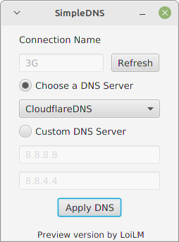
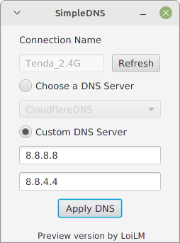
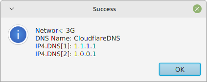
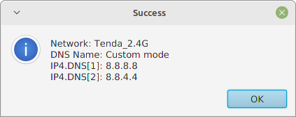

# SimpleDNS
SimpleDNS is a free tool to change Domain Name System (DNS) for <b>Linux</b>.

### Important
* The SimpleDNS tool <span style="color:red;">preview version</span> can be <span style="color:red;">unstable</span>
* LinuxMint:  <span style="color:green;">Tested</span>

### Screenshots





### Download
* SimpleDNS ([preview version](data/files/[PREVIEW]SimpleDNS.tar.gz))

### Run
Navigate to SimpleDNS directory and run command:
````
./RunSimpleDNS
````